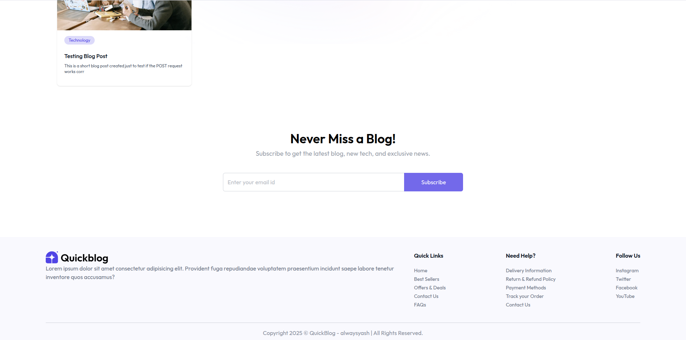
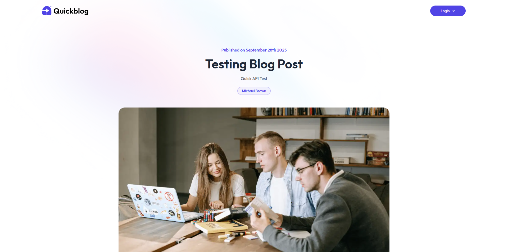
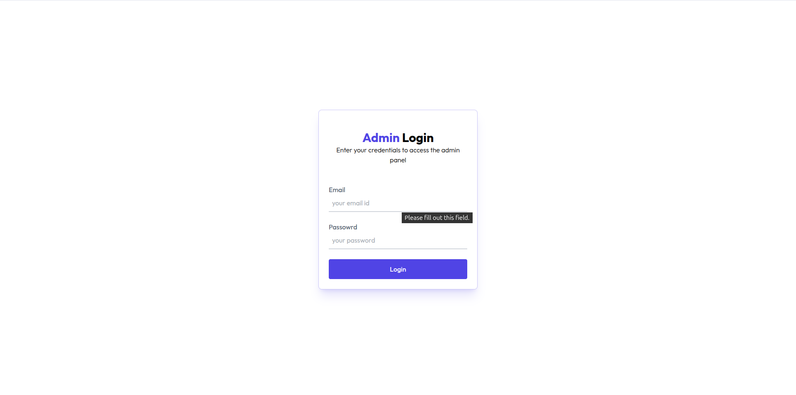
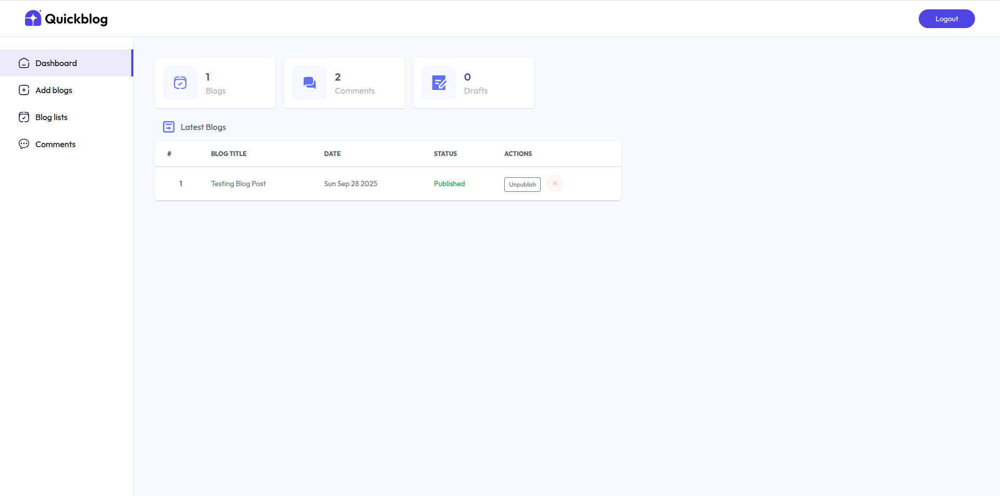
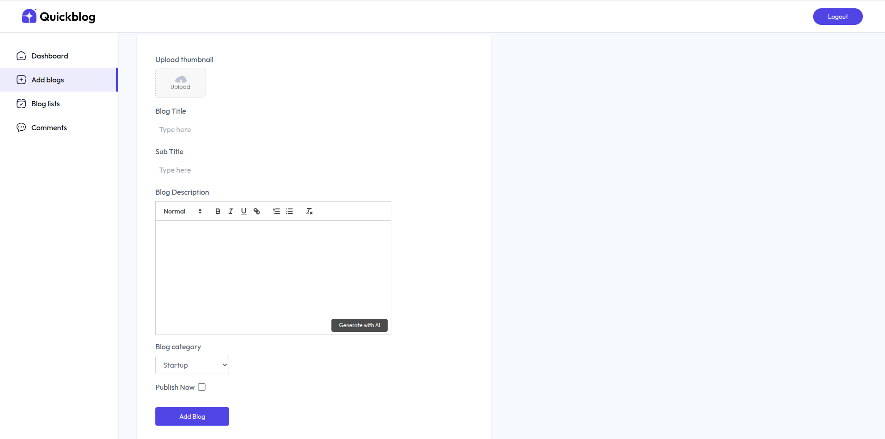
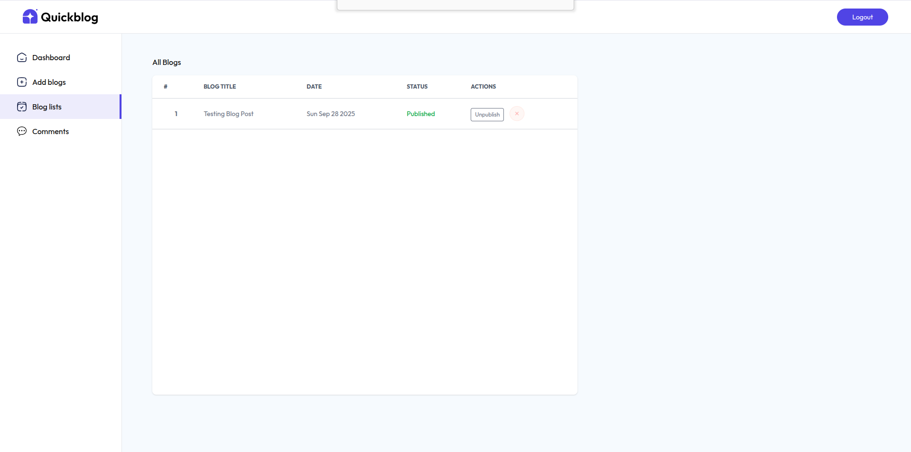
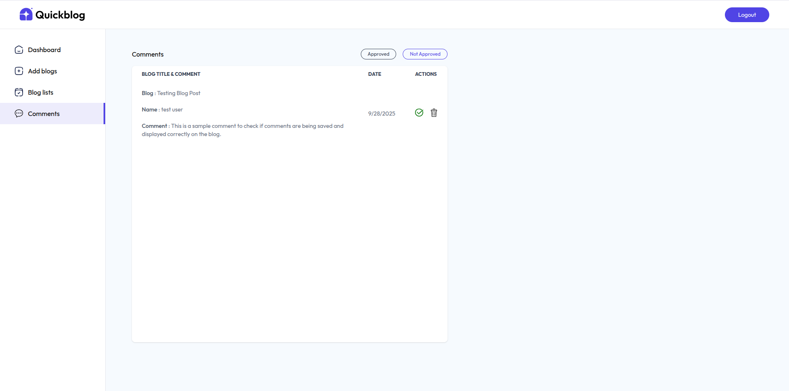

<h1 align="center">
  
  Blog App
</h1>

<p align="center">
QuickBlog is a <strong>full-stack MERN blog application</strong> powered by <strong>AI-generated content</strong>.<br>
It enables an admin to create and publish blogs effortlessly and allows users to explore blogs by category.
</p>

---

## 📸 Screenshots

<div align="center" style="display: flex; flex-wrap: wrap; gap: 10px; justify-content: center;">
  
  
  
  
  
  
  
  
</div>

---

## 🔗 Live Demo

[🚀 Visit Blog App](https://quick-blog-ebon.vercel.app/)

---

## 🚀 Features

- 🌓 Light & Dark theme toggle.  
- 🧩 Modular and reusable React components (`Navbar`, `Header`, `BlogCard`, etc.).  
- 📱 Fully responsive UI for desktop, tablet, and mobile.  
- 🎨 Styled with **Tailwind CSS** for a modern look.  
- ⚡ Smooth navigation and dynamic rendering of blogs from backend.  
- 📂 File structure optimized for maintainability.  
- 🔐 Admin dashboard with CRUD operations for blogs and comments.  
- 🤖 **AI-powered blog generation**: Admin can enter a topic, make a few decisions, and automatically generate blog content.  
- 📝 **Blog publishing**: Admin can easily post or publish blogs after generation.  
- 📂 **Categorized browsing**: Viewers can filter blogs based on categories for a personalized reading experience.  
- 💻 **Full-stack MERN**: React (frontend), Node.js + Express (backend), and MongoDB (database).  
- 🚀 **Modern development setup**: Vite for fast frontend development.

---

## 🧰 Tech Stack Used

- **React 19 + Vite** – Frontend framework and bundler  
- **Node.js + Express** – Backend API server  
- **MongoDB** – Database for blogs and comments  
- **Tailwind CSS v4** – Utility-first styling  
- **JavaScript (ES6+)** – Logic and interactivity  
- **REST APIs** – Backend communication  
- **AI Integration**: Generates blog content automatically, AI integration setup is currently delayed because Google Cloud requires linking a billing account with a ₹1000 pre-authorization hold, which needs to be processed before API keys can be generated.

---

## 📂 Project Directory Structure

```
quick-blog/
├── client/
│ ├── public/
│ │ └── favicon.svg
│ ├── src/
│ │ ├── assets/
│ │ ├── components/
│ │ │ ├── admin/
│ │ │ ├── BlogCard.jsx
│ │ │ ├── BlogList.jsx
│ │ │ └── ...
│ │ ├── context/
│ │ ├── pages/
│ │ │ ├── admin/
│ │ │ └── ...
│ │ ├── App.jsx
│ │ ├── index.css
│ │ └── main.jsx
│ ├── package.json
│ └── README.md
├── server/
│ ├── configs/
│ ├── controllers/
│ ├── middleware/
│ ├── models/
│ ├── routes/
│ ├── package.json
│ └── server.js
├── README.md
```


---

## 📄 License

This project is open-source and available under the [MIT License](LICENSE).

---

## 👤 Author

<table width="100%">
  <tr>
    <td align="left">
      <h3>Yash Kushwaha</h3>
    </td>
    <td align="right">
      <a href="mailto:yash274602@gmail.com"></a>
      <a href="https://www.instagram.com/alwaysyash616"></a>
      <a href="https://www.facebook.com/alwaysyash616"></a>
      <a href="https://www.linkedin.com/in/alwaysyash"></a>
      <a href="https://t.me/alwaysYash616"></a>
      <a href="https://github.com/alwaysyash616"></a>
    </td>
  </tr>
</table>

- GitHub: [alwaysyash616](https://github.com/zoom169speedster)  
- Instagram: [@alwaysyash616](https://www.instagram.com/alwaysyash616)  
- Facebook: [@alwaysyash616](https://www.facebook.com/alwaysyash616)  
- LinkedIn: [@alwaysyash616](https://www.linkedin.com/in/alwaysyash)  
- Telegram: [@alwaysYash616](https://t.me/alwaysYash616)  
- Email: yash274602@gmail.com  

---

> 💡 _“Little bit Pro🎓essional by @alwaysyash”_
